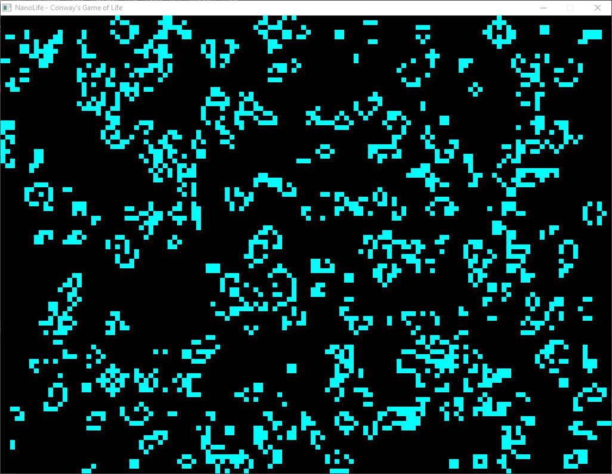

# NanoLife

John Conway's Game of Life implemented in Ruby with Gosu.

## Quick Start

### Using Gem

    $ gem install nanolife
    $ nanolife
    
### Including in Source Code

	$ irb
	>>> require 'nanolife'
    >>> game = LifeGameWindow.new
    >>> game.show

## Keybinds

- s - Start and stop (pause) the game
- c - Clear the grid
- r - Randomize the grid
- Left Click - Invert the state of the cell clicked
- q/Esc - Quit

Variables can be configured at the top of the program as constants.

## Screenshots

## Troubleshooting

Gosu gem dependency will require native build tools.
In Windows that means having the Ruby DevKit and in
Linux installing build-essential, libsdl2-dev,
libsdl-ttf-dev, libopenal-dev, libpango1.0-dev,
libsndfile-dev, and ruby-dev packages.

## Website

* [NanoLife on DevDungeon.com](http://www.devdungeon.com/content/nanolife)

## Source Code

* [NanoLife (GitHub.com)](https://www.github.com/DevDungeon/NanoLife)

## Ruby Gem

* [nanolife on RubyGems.org](https://rubygems.org/gems/nanolife)

## Contact

* NanoDano <nanodano@devdungeon.com>
* http://www.devdungeon.com

## License

MIT. See LICENSE.txt.

## Changelog

* v1.0 - 2016/11/19 - Releasing as gem on GitHub
* v0.1 - 2014/07/30 - Initial implementation
